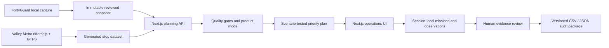

# Submission architecture

## System boundary

Heat Priority Engine is a Next.js application deployed on Vercel. The production
product is keyless and reads committed, integrity-checked data. Live FortyGuard
capture is a separate local operator workflow with explicit spend guards and is
not reachable from a page render.

## Components

- **Interface:** React 19 and Next.js 16 App Router pages for overview, heat,
  planning, missions, evidence review, scenarios, reports and methodology.
- **Backend:** Next.js route handlers validate requests, run deterministic
  planning and hold bounded run objects in instance memory for frozen exports.
- **Map:** MapLibre renders the heat field and stops; list/table fallbacks keep
  the decision usable if the basemap fails.
- **Sources:** one reviewed FortyGuard snapshot, generated Phoenix stop data,
  Valley Metro GTFS and documented public-source metadata.
- **Pipeline:** Python/TypeScript fetch and generation scripts preserve source
  metadata, hashes and canonical derived artefacts.
- **Prioritisation:** estimated exposure and validated local anomaly are separate
  axes. Quality gates disable unsupported axes; 324 scenarios measure selection
  frequency and rank range under uncertainty.
- **Hosting:** GitHub Actions verifies a clean clone; Vercel builds with `npm ci`
  and `npm run build` in `iad1`.

## Security and privacy limits

- No authentication or personal-data store is present; field entries are an
  explicitly labelled browser-session demonstration.
- The production UI and public routes cannot spend FortyGuard credits.
- The API key is server-only and absent from Git and browser bundles.
- Result URL fetching uses an explicit host allowlist; exports neutralise CSV
  formula injection; secret scan and dependency audit are release gates.
- Run state is instance-local. Cross-instance export misses fail closed with
  `409`; durable shared storage is deliberately post-submission.

For implementation-level details, see [`../architecture.md`](../architecture.md)
and [`../scoring-methodology.md`](../scoring-methodology.md).
